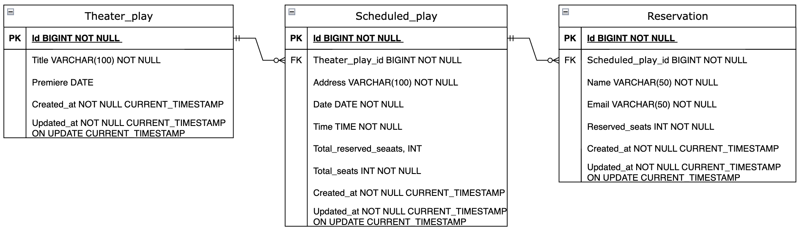

# Theater reservations

Application aims to manage seats availability for a scheduled play.

Theater employees have option to add new theater play, schedule it, i.e. announce the date, time and address when the
play will be shown and define the limit of available seats. Before the event it's possible to get the list of
reservations. Then event is ended it's possible to delete scheduled play with all related reservations to ensure GDPR
compliance.

Theater play viewers can make up to 3 seats reservation per time with possibility to cancel, i.e. delete a single
reservation.
In the reservation request it's mandatory to add name, valid email and number of seats reserved.

## Use cases

* Get theater play details by ID (public endpoint for all users)
* Get list of all theater plays (public endpoint for all users)
* Add new theater play (can be done only by user with "ADMIN" role)
* Delete theater play by ID (can be done only by user with "ADMIN" role)
* Update theater play by ID (can be done only by user with "ADMIN" role)
* Add new scheduled play (can be done only by users with "COORDINATOR" or "ADMIN" roles)
* Get all available scheduled plays (public endpoint for all users)
* Update scheduled play by ID (can be done only by users with "COORDINATOR" or "ADMIN" roles)
* Delete scheduled play by ID with all related reservations (can be done only by users with "COORDINATOR" or "ADMIN"
  roles
* Get list of reservations by scheduled play ID (can be done only by users with "COORDINATOR" or "ADMIN" roles)
* Add a reservation to the reservations' list of scheduled play (public endpoint for users to register)
* Get details of reservation by id (public endpoint for users to check their personal reservation)
* Delete reservation by id and by scheduled play id (public endpoint for users to cancel personal reservation)

## Available endpoints

http://localhost:8090/swagger-ui/index.html

## Database schema

